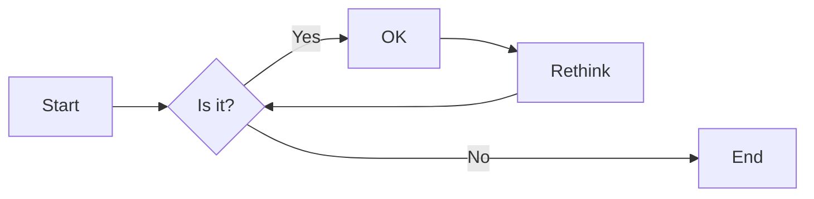
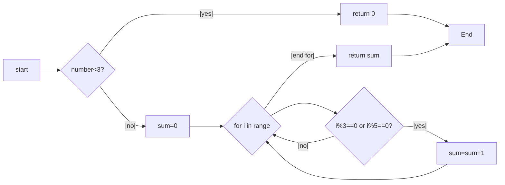
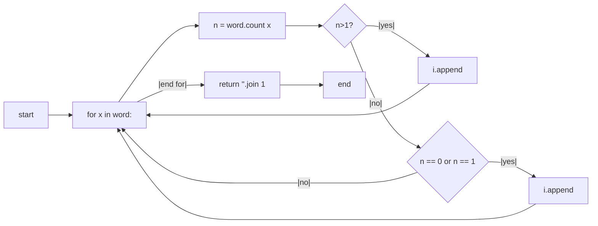
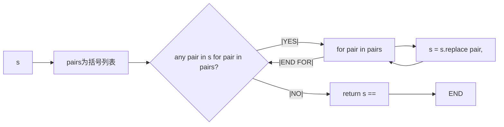
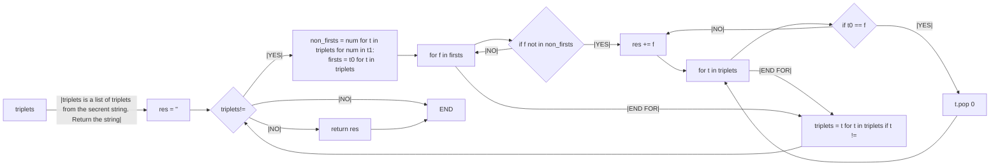
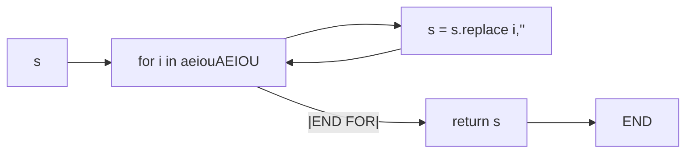

# 实验三 Python列表

班级： 21计科1

学号： B20210302126

姓名： 陶启睿

Github地址：<https://github.com/xBoltgun/python_class.git>

CodeWars地址：<https://www.codewars.com/users/Nuca%20Cola>

---

## 实验目的

1. 学习Python的简单使用和列表操作
2. 学习Python中的if语句

## 实验环境

1. Git
2. Python 3.10
3. VSCode
4. VSCode插件

## 实验内容和步骤

### 第一部分

Python列表操作

完成教材《Python编程从入门到实践》下列章节的练习：

- 第3章 列表简介
- 第4章 操作列表
- 第5章 if语句

---

### 第二部分

在[Codewars网站](https://www.codewars.com)注册账号，完成下列Kata挑战：

---

#### 第一题：3和5的倍数（Multiples of 3 or 5）

难度： 6kyu

如果我们列出所有低于 10 的 3 或 5 倍数的自然数，我们得到 3、5、6 和 9。这些数的总和为 23. 完成一个函数，使其返回小于某个整数的所有是3 或 5 的倍数的数的总和。此外，如果数字为负数，则返回 0。

注意：如果一个数同时是3和5的倍数，应该只被算一次。

**提示：首先使用列表解析得到一个列表，元素全部是3或者5的倍数。
使用sum函数可以获取这个列表所有元素的和.**

代码提交地址：
<https://www.codewars.com/kata/514b92a657cdc65150000006>

---

#### 第二题： 重复字符的编码器（Duplicate Encoder）

难度： 6kyu

本练习的目的是将一个字符串转换为一个新的字符串，如果新字符串中的每个字符在原字符串中只出现一次，则为"("，如果该字符在原字符串中出现多次，则为")"。在判断一个字符是否是重复的时候，请忽略大写字母。

例如:

```python
"din"      =>  "((("
"recede"   =>  "()()()"
"Success"  =>  ")())())"
"(( @"     =>  "))(("
```

代码提交地址:
<https://www.codewars.com/kata/54b42f9314d9229fd6000d9c>

---

#### 第三题：括号匹配（Valid Braces）

难度：6kyu

写一个函数，接收一串括号，并确定括号的顺序是否有效。如果字符串是有效的，它应该返回True，如果是无效的，它应该返回False。
例如：

```python
"(){}[]" => True 
"([{}])" => True
 "(}" => False
 "[(])" => False 
"[({})](]" => False
```

**提示：
python中没有内置堆栈数据结构，可以直接使用`list`来作为堆栈，其中`append`方法用于入栈，`pop`方法可以出栈。**

代码提交地址
<https://www.codewars.com/kata/5277c8a221e209d3f6000b56>

---

#### 第四题： 从随机三元组中恢复秘密字符串(Recover a secret string from random triplets)

难度： 4kyu

有一个不为你所知的秘密字符串。给出一个随机三个字母的组合的集合，恢复原来的字符串。

这里的三个字母的组合被定义为三个字母的序列，每个字母在给定的字符串中出现在下一个字母之前。"whi "是字符串 "whatisup "的一个三个字母的组合。

作为一种简化，你可以假设没有一个字母在秘密字符串中出现超过一次。

对于给你的三个字母的组合，除了它们是有效的三个字母的组合以及它们包含足够的信息来推导出原始字符串之外，你可以不做任何假设。特别是，这意味着秘密字符串永远不会包含不出现在给你的三个字母的组合中的字母。

测试用例：

```python
secret = "whatisup"
triplets = [
  ['t','u','p'],
  ['w','h','i'],
  ['t','s','u'],
  ['a','t','s'],
  ['h','a','p'],
  ['t','i','s'],
  ['w','h','s']
]
test.assert_equals(recoverSecret(triplets), secret)
```

代码提交地址：
<https://www.codewars.com/kata/53f40dff5f9d31b813000774/train/python>

提示：

- 利用集合去掉`triplets`中的重复字母，得到字母集合`letters`，最后的`secret`应该由集合中的字母组成，`secret`长度也等于该集合。

```python
letters = {letter for triplet in triplets for letter in triplet }
length = len(letters)
```

- 创建函数`check_first_letter(triplets, first_letter)`，检测一个字母是不是secret的首字母，返回True或者False。
- 创建函数`remove_first_letter(triplets, first_letter)`,  从三元组中去掉首字母，返回新的三元组。
- 遍历字母集合letters，利用上面2个函数得到最后的结果`secret`。

---

#### 第五题： 去掉喷子的元音（Disemvowel Trolls）

难度： 7kyu

喷子正在攻击你的评论区!
处理这种情况的一个常见方法是删除喷子评论中的所有元音(字母：a,e,i,o,u)，以消除威胁。
你的任务是写一个函数，接收一个字符串并返回一个去除所有元音的新字符串。
例如，字符串 "This website is for losers LOL!"   将变成 "Ths wbst s fr lsrs LL!".

注意：对于这个Kata来说，y不被认为是元音。
代码提交地址：
<https://www.codewars.com/kata/52fba66badcd10859f00097e>

提示：

- 首先使用列表解析得到一个列表，列表中所有不是元音的字母。
- 使用字符串的join方法连结列表中所有的字母，例如：

```python
last_name = "lovelace"
letters = [letter for letter in last_name ]
print(letters) # ['l', 'o', 'v', 'e', 'l', 'a', 'c', 'e']
name = ''.join(letters) # name = "lovelace"
```

---

### 第三部分

使用Mermaid绘制程序流程图

安装VSCode插件：

- Markdown Preview Mermaid Support
- Mermaid Markdown Syntax Highlighting

使用Markdown语法绘制你的程序绘制程序流程图（至少一个），Markdown代码如下：


显示效果如下：



查看Mermaid流程图语法-->[点击这里](https://mermaid.js.org/syntax/flowchart.html)

使用Markdown编辑器（例如VScode）编写本次实验的实验报告，包括[实验过程与结果](#实验过程与结果)、[实验考查](#实验考查)和[实验总结](#实验总结)，并将其导出为 **PDF格式** 来提交。

## 实验过程与结果

请将实验过程与结果放在这里，包括：

- [第一部分 Python列表操作和if语句](#第一部分)
- [第二部分 Codewars Kata挑战](#第二部分)
- [第三部分 使用Mermaid绘制程序流程图](#第三部分)

注意代码需要使用markdown的代码块格式化，例如Git命令行语句应该使用下面的格式：


显示效果如下：

```bash
git init
git add .
git status
git commit -m "first commit"
```

如果是Python代码，应该使用下面代码块格式，例如：


## 第一部分：Python列表操作和if语句

我把这一部分的内容放在了后面的实验考察部分

## 第二部分：kata挑战的代码

第一题显示效果如下：Multiples of 3 or 5

```python
def solution(number):
    if number <3:
        return 0
    sum=0
    for i in range(3,number):
        if i%3==0 or i%5==0:
            sum = sum+i
    return sum
```

第二题显示效果如下：Duplicate Encoder

```python
def duplicate_encode(word):
	word = word.lower()
	l = []
	for x in word:
		n = word.count(x)
		if n > 1:
			l.append(')')
		elif n == 0 or n == 1:
			l.append('(')
	return ''.join(l)
```

第三题显示效果如下：Valid Braces

```python
def validBraces(string):
    braces = "(){}[]"
    stack = []
    for c in string:
        if c in '({[':
            stack.append(c)
        elif c in ')}]':
            if not stack:
                return False
            if stack[-1] != braces[braces.index(c)-1]:
                return False
            else:
                stack.pop()
    if not stack:
        return True
    else:
        return False
```

第四题显示效果如下：Recover a secret string from random triplets

```python
def recoverSecret(triplets):
    'triplets is a list of triplets from the secrent string. Return the string.'
    res = ''
    while triplets != []:
        non_firsts = [num for t in triplets for num in t[1:]]
        firsts = [t[0] for t in triplets]
        for f in firsts:
            if f not in non_firsts:
                res += f
                for t in triplets:
                    if t[0] == f:
                        t.pop(0)
                break
        triplets = [t for t in triplets if t != []]
    return res

```

第五题效果显示如下：Disemvowel Trolls

```python
def disemvowel(string):
    vowels = 'aeiouAEIOU'
    new_string = ''
    for i in string:

        if i not in vowels:

            new_string+= i 
    return new_string
```

代码运行结果的文本可以直接粘贴在这里。

## 第三部分kata挑战代码流程图

第一题：Multiples of 3 or 5



第二题：Duplicate Encoder



第三题：Valid Braces



第四题：Recover a secret string from random triplets



第五题：Disemvowel Trolls



**注意：不要使用截图，Markdown文档转换为Pdf格式后，截图可能会无法显示。**

## 实验考查

请使用自己的语言并使用尽量简短代码示例回答下面的问题，这些问题将在实验检查时用于提问和答辩以及实际的操作。

1. Python中的列表可以进行哪些操作？
2. 哪两种方法可以用来对Python的列表排序？这两种方法有和区别？
3. 如何将Python列表逆序打印？
4. Python中的列表执行哪些操作时效率比较高？哪些操作效率比较差？是否有类似的数据结构可以用来替代列表？
5. 阅读《Fluent Python》Chapter 2. An Array of Sequence - Tuples Are Not Just Immutable Lists小节（p30-p35）。总结该小节的主要内容。

## 对于实验考察的回答

1. Python中列表(List)的详解操作方法,包含创建、访问、更新、删除、其它操作等,实际情况如下：

一、创建一个列表：
只要把逗号分隔的不同的数据项使用方括号括起来即可。如下所示：

```python
list1 = ['physics', 'chemistry', 1997, 2000]

list2 = [1, 2, 3, 4, 5 ]

list3 = ["a", "b", "c", "d"]
```

与字符串的索引一样，列表索引从0开始。列表可以进行截取、组合等。

二、访问列表中的值

使用下标索引来访问列表中的值，同样你也可以使用方括号的形式截取字符，如下所示：

```python
list1 = ['physics', 'chemistry', 1997, 2000]
list2 = [1, 2, 3, 4, 5, 6, 7 ]
print "list1[0]: ", list1[0]
print "list2[1:5]: ", list2[1:5]
```

以上实例输出结果：

```python
list1[0]:  physics
list2[1:5]:  [2, 3, 4, 5]
```

三、更新列表

你可以对列表的数据项进行修改或更新，你也可以使用append()方法来添加列表项，如下所示：

```python
list = ['physics', 'chemistry', 1997, 2000]
print "Value available at index 2 : "
print list[2]
list[2] = 2001
print "New value available at index 2 : "
print list[2]
```

以上实例输出结果：

```python
Value available at index 2 :
1997
New value available at index 2 :
2001
```

四、删除列表元素

可以使用 del 语句来删除列表的的元素，如下实例：

```python
list1 = ['physics', 'chemistry', 1997, 2000]
print list1
del list1[2]
print "After deleting value at index 2 : "
print list1
```

以上实例输出结果：

```python
['physics', 'chemistry', 1997, 2000]
After deleting value at index 2 :
['physics', 'chemistry', 2000]
```

还有许多操作这里就不一一举例了。

2. Python提供了两个方法对给定的List L进行排序 ：方法1.用对List的成员函数sort进行排序，方法2.用内置函数sorted进行排序。list 的 sort 方法返回的是对已经存在的列表进行操作，而内建函数 sorted 方法返回的是一个新的 list，而不是在原来的基础上进行的操作。
3. 在Python中，我们可以通过reverse()方法或者使用切片语法来实现逆序输出一个列表。例如：

```python
my_list = [1, 2, 3, 4, 5]
my_list.reverse()
print(my_list)
```

结果如下：

```python
[5, 4, 3, 2, 1]
```

4. 使用局部变量尽量使用局部变量代替全局变量：便于维护，提高性能并节省内存。一方面可以提高程序性能，局部变量查找速度更快;另一方面可用简短标识符替代冗长的模块变量，提高可读性。
5. Python的序列类型很丰富，有list,tuple,str,bytes,bytearray,memoryview rray.array等。可以分为容器序列和扁平序列，容器序列存放的任意类型的对象的引用，扁平序列存放的是值而不是引用序列类型按能否被修改还可分为可变序列和不可变序列这一章主要讲了list,tuple这两种序列类型.

## 实验总结

这一次主要是认识了python中的列表结构，学习了许多的应用，包括对列表的操作例如 建立、访问、更新、删除、其它操作等。实验对应于的要求越来越高绝大多数的实在联系里面学到的，包括，算法，和思想，总之收益良多。
