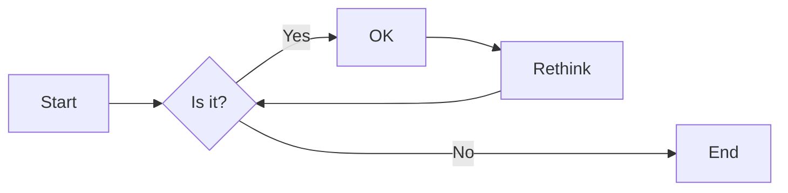
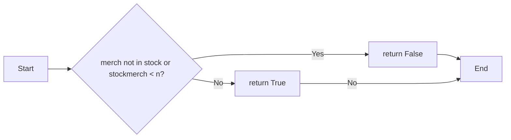

# 实验四 Python字典和while循环

班级： 21计科1

学号： B20210302126

姓名： 陶启睿

Github地址：<https://github.com/xBoltgun/python_class.git>

CodeWars地址：<https://www.codewars.com/users/Nuca%20Cola>

---

## 实验目的

1. 学习Python字典
2. 学习Python用户输入和while循环

## 实验环境

1. Git
2. Python 3.10
3. VSCode
4. VSCode插件

## 实验内容和步骤

### 第一部分

Python列表操作

完成教材《Python编程从入门到实践》下列章节的练习：

- 第6章 字典
- 第7章 用户输入和while循环

---

### 第二部分

在[Codewars网站](https://www.codewars.com)注册账号，完成下列Kata挑战：

---

#### 第一题：淘气还是乖孩子（Naughty or Nice）

难度： 7kyu

圣诞老人要来镇上了，他需要你帮助找出谁是淘气的或善良的。你将会得到一整年的JSON数据，按照这个格式：

```python
{
    January: {
        '1': 'Naughty','2': 'Naughty', ..., '31': 'Nice'
    },
    February: {
        '1': 'Nice','2': 'Naughty', ..., '28': 'Nice'
    },
    ...
    December: {
        '1': 'Nice','2': 'Nice', ..., '31': 'Naughty'
    }
}
```

你的函数应该返回 "Naughty!"或 "Nice!"，这取决于在某一年发生的总次数（以较大者为准）。如果两者相等，则返回 "Nice！"。
代码提交地址：
<https://www.codewars.com/kata/5662b14e0a1fb8320a00005c>

---

#### 第二题： 观察到的PIN（The observed PIN）

难度：4kyu

好了，侦探，我们的一个同事成功地观察到了我们的目标人物，抢劫犯罗比。我们跟踪他到了一个秘密仓库，我们认为在那里可以找到所有被盗的东西。这个仓库的门被一个电子密码锁所保护。不幸的是，我们的间谍不确定他看到的密码，当罗比进入它时。

键盘的布局如下：

```python
┌───┬───┬───┐
│ 1 │ 2 │ 3 │
├───┼───┼───┤
│ 4 │ 5 │ 6 │
├───┼───┼───┤
│ 7 │ 8 │ 9 │
└───┼───┼───┘
    │ 0 │
    └───┘
```

他注意到密码1357，但他也说，他看到的每个数字都有可能是另一个相邻的数字（水平或垂直，但不是对角线）。例如，代替1的也可能是2或4。而不是5，也可能是2、4、6或8。

他还提到，他知道这种锁。你可以无限制地输入错误的密码，但它们最终不会锁定系统或发出警报。这就是为什么我们可以尝试所有可能的（*）变化。

*可能的意义是：观察到的PIN码本身和考虑到相邻数字的所有变化。

你能帮助我们找到所有这些变化吗？如果有一个函数，能够返回一个列表，其中包含一个长度为1到8位的观察到的PIN的所有变化，那就更好了。我们可以把这个函数命名为getPINs（在python中为get_pins，在C#中为GetPINs）。

但请注意，所有的PINs，包括观察到的PINs和结果，都必须是字符串，因为有可能会有领先的 "0"。我们已经为你准备了一些测试案例。
侦探，我们就靠你了!
代码提交地址：
<https://www.codewars.com/kata/5263c6999e0f40dee200059d>

---

#### 第三题： RNA到蛋白质序列的翻译（RNA to Protein Sequence Translation）

难度：6kyu

蛋白质是由DNA转录成RNA，然后转译成蛋白质的中心法则。RNA和DNA一样，是由糖骨架（在这种情况下是核糖）连接在一起的长链核酸。每个由三个碱基组成的片段被称为密码子。称为核糖体的分子机器将RNA密码子转译成氨基酸链，称为多肽链，然后将其折叠成蛋白质。

蛋白质序列可以像DNA和RNA一样很容易地可视化，作为大字符串。重要的是要注意，“停止”密码子不编码特定的氨基酸。它们的唯一功能是停止蛋白质的转译，因此它们不会被纳入多肽链中。“停止”密码子不应出现在最终的蛋白质序列中。为了节省您许多不必要（和乏味）的键入，已为您的氨基酸字典提供了键和值。

给定一个RNA字符串，创建一个将RNA转译为蛋白质序列的函数。注意：测试用例将始终生成有效的字符串。

```python
protein（'UGCGAUGAAUGGGCUCGCUCC'）
```

将返回`CDEWARS`

作为测试用例的一部分是一个真实世界的例子！最后一个示例测试用例对应着一种叫做绿色荧光蛋白的蛋白质，一旦被剪切到另一个生物体的基因组中，像GFP这样的蛋白质可以让生物学家可视化细胞过程！

Amino Acid Dictionary

```python
   # Your dictionary is provided as PROTEIN_DICT
   PROTEIN_DICT = {
    # Phenylalanine
    'UUC': 'F', 'UUU': 'F',
    # Leucine
    'UUA': 'L', 'UUG': 'L', 'CUU': 'L', 'CUC': 'L', 'CUA': 'L', 'CUG': 'L',
    # Isoleucine
    'AUU': 'I', 'AUC': 'I', 'AUA': 'I',
    # Methionine
    'AUG': 'M',
    # Valine
    'GUU': 'V', 'GUC': 'V', 'GUA': 'V', 'GUG': 'V',
    # Serine
    'UCU': 'S', 'UCC': 'S', 'UCA': 'S', 'UCG': 'S', 'AGU': 'S', 'AGC': 'S',
    # Proline
    'CCU': 'P', 'CCC': 'P', 'CCA': 'P', 'CCG': 'P',
    # Threonine
    'ACU': 'T', 'ACC': 'T', 'ACA': 'T', 'ACG': 'T',
    # Alanine
    'GCU': 'A', 'GCC': 'A', 'GCA': 'A', 'GCG': 'A',
    # Tyrosine
    'UAU': 'Y', 'UAC': 'Y',
    # Histidine
    'CAU': 'H', 'CAC': 'H',
    # Glutamine
    'CAA': 'Q', 'CAG': 'Q',
    # Asparagine
    'AAU': 'N', 'AAC': 'N',
    # Lysine
    'AAA': 'K', 'AAG': 'K',
    # Aspartic Acid
    'GAU': 'D', 'GAC': 'D',
    # Glutamic Acid
    'GAA': 'E', 'GAG': 'E',
    # Cystine
    'UGU': 'C', 'UGC': 'C',
    # Tryptophan
    'UGG': 'W',
    # Arginine
    'CGU': 'R', 'CGC': 'R', 'CGA': 'R', 'CGG': 'R', 'AGA': 'R', 'AGG': 'R',
    # Glycine
    'GGU': 'G', 'GGC': 'G', 'GGA': 'G', 'GGG': 'G',
    # Stop codon
    'UAA': 'Stop', 'UGA': 'Stop', 'UAG': 'Stop'
}
```

代码提交地址：
<https://www.codewars.com/kata/555a03f259e2d1788c000077>

---

#### 第四题： 填写订单（Thinkful - Dictionary drills: Order filler）

难度：8kyu

您正在经营一家在线业务，您的一天中很大一部分时间都在处理订单。随着您的销量增加，这项工作占用了更多的时间，不幸的是最近您遇到了一个情况，您接受了一个订单，但无法履行。

您决定写一个名为`fillable()`的函数，它接受三个参数：一个表示您库存的字典`stock`，一个表示客户想要购买的商品的字符串`merch`，以及一个表示他们想购买的商品数量的整数n。如果您有足够的商品库存来完成销售，则函数应返回`True`，否则应返回`False`。

有效的数据将始终被传入，并且n将始终大于等于1。

代码提交地址：
<https://www.codewars.com/kata/586ee462d0982081bf001f07/python>

---

#### 第五题： 莫尔斯码解码器（Decode the Morse code, advanced）

难度： 4kyu

在这个作业中，你需要为有线电报编写一个莫尔斯码解码器。
有线电报通过一个有按键的双线路运行，当按下按键时，会连接线路，可以在远程站点上检测到。莫尔斯码将每个字符的传输编码为"点"（按下按键的短按）和"划"（按下按键的长按）的序列。

在传输莫尔斯码时，国际标准规定：

- "点" - 1个时间单位长。
- "划" - 3个时间单位长。
- 字符内点和划之间的暂停 - 1个时间单位长。
- 单词内字符之间的暂停 - 3个时间单位长。
- 单词间的暂停 - 7个时间单位长。

但是，该标准没有规定"时间单位"有多长。实际上，不同的操作员会以不同的速度进行传输。一个业余人士可能需要几秒钟才能传输一个字符，一位熟练的专业人士可以每分钟传输60个单词，而机器人发射器可能会快得多。

在这个作业中，我们假设消息的接收是由硬件自动执行的，硬件会定期检查线路，如果线路连接（远程站点的按键按下），则记录为1，如果线路未连接（远程按键弹起），则记录为0。消息完全接收后，它会以一个只包含0和1的字符串的形式传递给你进行解码。

例如，消息`HEYJUDE`，即`·····−·−−··−−−··−−··`可以如下接收：

```python
1100110011001100000011000000111111001100111111001111110000000000000011001111110011111100111111000000110011001111110000001111110011001100000011
```

如您所见，根据标准，这个传输完全准确，硬件每个"点"采样了两次。

因此，你的任务是实现两个函数：

函数decodeBits(bits)，应该找出消息的传输速率，正确解码消息为点（.）、划（-）和空格（字符之间有一个空格，单词之间有三个空格），并将它们作为一个字符串返回。请注意，在消息的开头和结尾可能会出现一些额外的0，确保忽略它们。另外，如果你无法分辨特定的1序列是点还是划，请假设它是一个点。

函数decodeMorse(morseCode)，它将接收上一个函数的输出，并返回一个可读的字符串。

注意：出于编码目的，你必须使用ASCII字符.和-，而不是Unicode字符。

莫尔斯码表已经预加载给你了（请查看解决方案设置，以获取在你的语言中使用它的标识符）。

```python
morseCodes(".--")  #to access the morse translation of ".--"
```

下面是Morse码支持的完整字符列表：

```javascript
A    ·–
B    –···
C    –·–·
D    –··
E    ·
F    ··–·
G    ––·
H    ····
I    ··
J    ·–––
K    –·–
L    ·–··
M    ––
N    –·
O    –––
P    ·––·
Q    ––·–
R    ·–·
S    ···
T    –
U    ··–
V    ···–
W    ·––
X    –··–
Y    –·––
Z    ––··
0    –––––
1    ·––––
2    ··–––
3    ···––
4    ····–
5    ·····
6    –····
7    ––···
8    –––··
9    ––––·
.    ·–·–·–
,    ––··––
?    ··––··
'    ·––––·
!    –·–·––
/    –··–·
(    –·––·
)    –·––·–
&    ·–···
:    –––···
;    –·–·–·
=    –···–
+    ·–·–·
-    –····–
_    ··––·–
"    ·–··–·
$    ···–··–
@    ·––·–·
```

代码提交地址：
<https://www.codewars.com/kata/decode-the-morse-code-advanced>

---

### 第三部分

使用Mermaid绘制程序流程图

安装VSCode插件：

- Markdown Preview Mermaid Support
- Mermaid Markdown Syntax Highlighting

使用Markdown语法绘制你的程序绘制程序流程图（至少一个），Markdown代码如下：


显示效果如下：



查看Mermaid流程图语法-->[点击这里](https://mermaid.js.org/syntax/flowchart.html)

使用Markdown编辑器（例如VScode）编写本次实验的实验报告，包括[实验过程与结果](#实验过程与结果)、[实验考查](#实验考查)和[实验总结](#实验总结)，并将其导出为 **PDF格式** 来提交。

## 实验过程与结果

请将实验过程与结果放在这里，包括：

- [第一部分 Python列表操作和if语句](#第一部分)
- [第二部分 Codewars Kata挑战](#第二部分)
- [第三部分 使用Mermaid绘制程序流程图](#第三部分)

### 第二部分 Codewars Kata挑战

#### [第一题：淘气还是乖孩子（Naughty or Nice）](<https://www.codewars.com/kata/5662b14e0a1fb8320a00005c>)

Code:

```python
def naughty_or_nice(data):
    mood = 0
    str1 = 'Nice!'
    str2 = 'Naughty!'
    for month,days in data.items():
        for day,moods in days.items():
            if moods == 'Nice':
                mood +=1
            if moods == 'Naughty':
                mood -=1
    if mood >=0:
        return str1
    else:
        return str2
```

---

#### [第二题： 观察到的PIN（The observed PIN）](<https://www.codewars.com/kata/5263c6999e0f40dee200059d>)

Code:

```python
from itertools import product
key_dict = {
        "1" : ["1", "2", "4"],
        "2" : ["1", "2", "3", "5"],
        "3" : ["2", "3", "6"],
        "4" : ["1", "4", "5", "7"],
        "5" : ["2", "4", "5", "6", "8"],
        "6" : ["3", "5", "6", "9"],
        "7" : ["4", "7", "8"],
        "8" : ["5", "7", "8", "9", "0"],
        "9" : ["6", "8", "9"],
        "0" : ["8", "0"]
    }
def get_pins(observed): 

    # 根据输入得到二维数组
    nested_list =[  key_dict[ch]  for ch in observed ]
# 最后将所有组合的数字列表转化为字符串
    return ([''.join(item) for item in product(*nested_list)])
```

---

#### [第三题： RNA到蛋白质序列的翻译（RNA to Protein Sequence Translation）](<https://www.codewars.com/kata/555a03f259e2d1788c000077>)

Code:

```python
def protein(rna):
    codons = [rna[i:i+3] for i in range(0, len(rna), 3)]
    chain = []
    for codon in codons:
        if PROTEIN_DICT[codon] != 'Stop':
            chain.append(PROTEIN_DICT[codon])
        else:
            break
    return ''.join(chain)
```

---

#### [第四题： 填写订单（Thinkful - Dictionary drills: Order filler）](<https://www.codewars.com/kata/586ee462d0982081bf001f07/python>)

Code:

```python
def fillable(stock, merch, n):
    if merch in stock:
        if stock[merch]>=n:
            return True
    return False
```

---

#### [第五题： 莫尔斯码解码器（Decode the Morse code, advanced）](<https://www.codewars.com/kata/decode-the-morse-code-advanced>)

Code:

```python
def decode_bits(bits):
    bits = bits.strip('0')
    len0=0
    len1=0
    min0=9999999
    min1=9999999
    fre=bits[0]
    for i in bits:
        if i=='0' :
            if i==fre :
                len0+=1
            else:
                min1=min(min1,len1)
                len1=0
                len0+=1
        else:
            if i==fre :
                len1+=1
            else:
                min0=min(min0,len0)
                len0=0
                len1+=1
        fre=i
    len=min(min0,min1)
    if min0==9999999 and min1==9999999:
        if len0==0 and len1!=0:
            len=len1
        elif len1==0 and len0!=0:
            len=len0
        else:
            len=min(len0,len1)
        
    return bits[::len].replace('111', '-').replace('1','.').replace('0000000','   ').replace('000',' ').replace('0','')

def decode_morse(morseCode):
    morseCode=morseCode.replace('   ','#').replace('0','')
    temp=''
    ans=''
    for x in morseCode:
        if x!=' ' :
            if x=='#':
                if temp != '':
                    ans=ans+MORSE_CODE[temp]
                temp=''
                ans+=' '
            else:
                temp=temp+x
        else:
            #print(temp)
            if temp != '':
                ans=ans+MORSE_CODE[temp]
            temp=''
    if temp != '':
                ans=ans+MORSE_CODE[temp]
    return ans
```

### 第三部分 使用Mermaid绘制程序流程图

```python
def fillable(stock, merch, n):
    if merch not in stock or stock[merch] < n:
        return False
    else:
        return True
```



---

## 实验考查

请使用自己的语言并使用尽量简短代码示例回答下面的问题，这些问题将在实验检查时用于提问和答辩以及实际的操作。

1. 字典的键和值有什么区别？
    - 字典的键和值是相互关联的，键用于查找和索引字典中的元素，而值则存储了与键关联的实际数据。
2. 在读取和写入字典时，需要使用默认值可以使用什么方法？
    - 可以使用字典的get()方法来读取字典中的值，如果指定的键不存在于字典中，则返回一个默认值。同样，也可以使用该方法来写入字典，将指定的键和值添加到字典中。
    - 示例：

    ```python
    my_dict = {'a': 1, 'b': 2, 'c': 3}  
    
    # 使用默认值读取字典中的值  
    value_a = my_dict.get('a', 0)   
    value_d = my_dict.get('d', 0)   
    
    # 使用默认值写入字典  
    my_dict['e'] = 4  
    my_dict['f'] = 5  
    
    # 使用默认值更新字典中的值  
    my_dict.setdefault('b', 6)  
    my_dict.setdefault('c', 7)  
    
    # 输出更新后的字典  
    print(my_dict) 
    ```

3. Python中的while循环和for循环有什么区别？
    - while循环在满足条件时重复执行代码块，直到条件不再满足；而for循环则用于遍历序列，每次从序列中取出一个元素执行一次代码块，直到遍历完整个序列。
    - while循环适用于不确定循环次数的场景，而for循环适用于需要遍历序列的场景。
    - 在处理大量数据时，使用for循环更高效，因为不需要反复计算条件表达式的值。如果需要基于条件终止循环，建议使用while循环。
4. 阅读[PEP 636 – Structural Pattern Matching: Tutorial](https://peps.python.org/pep-0636/), 总结Python 3.10中新出现的match语句的使用方法。
   - match语句可以进行结构化模式匹配。match语句类似于条件语句，但更具表达力，更易读。可以根据变量值选择执行不同的代码块，也可以使用多个模式进行更复杂的匹配。

   ```python
    x = 5  
    match x:  
        case 1:  
            print("x is 1")  
        case 2:  
            print("x is 2")  
        case _:  
            print("x is not 1 or 2")
   ```

## 实验总结

在这次实验中，我深入学习了Python的字典以及用户输入和while循环。Python字典可以存储任意类型的数据，且键值对可以快速检索。字典的创建和访问非常直观，使用{}来创建，使用[]来访问。