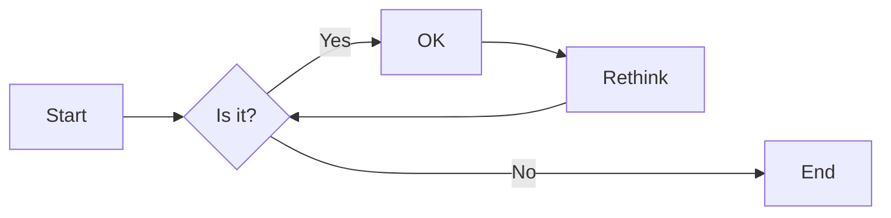
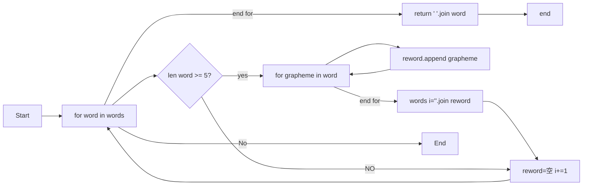

# 实验五 Python数据结构与数据模型

班级： 21计科1

学号： 20210302126

姓名： 陶启睿

Github地址：<https://github.com/xBoltgun/python_class.git>

CodeWars地址：<https://www.codewars.com/users/Nuca%20Cola>
---

## 实验目的

1. 学习Python数据结构的高级用法
2. 学习Python的数据模型

## 实验环境

1. Git
2. Python 3.10
3. VSCode
4. VSCode插件

## 实验内容和步骤

### 第一部分

在[Codewars网站](https://www.codewars.com)注册账号，完成下列Kata挑战：

---

#### 第一题：停止逆转我的单词

难度： 6kyu

编写一个函数，接收一个或多个单词的字符串，并返回相同的字符串，但所有5个或更多的字母单词都是相反的（就像这个Kata的名字一样）。传入的字符串将只由字母和空格组成。只有当出现一个以上的单词时，才会包括空格。
例如：

```python
spinWords( "Hey fellow warriors" ) => returns "Hey wollef sroirraw" 
spinWords( "This is a test") => returns "This is a test" 
spinWords( "This is another test" )=> returns "This is rehtona test"
```

代码提交地址：
<https://www.codewars.com/kata/5264d2b162488dc400000001>

提示：

- 利用str的split方法可以将字符串分为单词列表
例如：

```python
words = "hey fellow warrior".split()
# words should be ['hey', 'fellow', 'warrior']
```

- 利用列表推导将长度大于等于5的单词反转(利用切片word[::-1])
- 最后使用str的join方法连结列表中的单词。

---

#### 第二题： 发现离群的数(Find The Parity Outlier)

难度：6kyu

给你一个包含整数的数组（其长度至少为3，但可能非常大）。该数组要么完全由奇数组成，要么完全由偶数组成，除了一个整数N。请写一个方法，以该数组为参数，返回这个 "离群 "的N。

例如：

```python
[2, 4, 0, 100, 4, 11, 2602, 36]
# Should return: 11 (the only odd number)

[160, 3, 1719, 19, 11, 13, -21]
# Should return: 160 (the only even number)
```

代码提交地址：
<https://www.codewars.com/kata/5526fc09a1bbd946250002dc>

---

#### 第三题： 检测Pangram

难度：6kyu

pangram是一个至少包含每个字母一次的句子。例如，"The quick brown fox jumps over the lazy dog "这个句子就是一个pangram，因为它至少使用了一次字母A-Z（大小写不相关）。

给定一个字符串，检测它是否是一个pangram。如果是则返回`True`，如果不是则返回`False`。忽略数字和标点符号。
代码提交地址：
<https://www.codewars.com/kata/545cedaa9943f7fe7b000048>

---

#### 第四题： 数独解决方案验证

难度：6kyu

数独背景

数独是一种在 9x9 网格上进行的游戏。游戏的目标是用 1 到 9 的数字填充网格的所有单元格，以便每一列、每一行和九个 3x3 子网格（也称为块）中的都包含数字 1 到 9。更多信息请访问：<http://en.wikipedia.org/wiki/Sudoku>

编写一个函数接受一个代表数独板的二维数组，如果它是一个有效的解决方案则返回 true，否则返回 false。数独板的单元格也可能包含 0，这将代表空单元格。包含一个或多个零的棋盘被认为是无效的解决方案。棋盘总是 9 x 9 格，每个格只包含 0 到 9 之间的整数。

代码提交地址：
<https://www.codewars.com/kata/63d1bac72de941033dbf87ae>

---

#### 第五题： 疯狂的彩色三角形

难度： 2kyu

一个彩色的三角形是由一排颜色组成的，每一排都是红色、绿色或蓝色。连续的几行，每一行都比上一行少一种颜色，是通过考虑前一行中的两个相接触的颜色而产生的。如果这些颜色是相同的，那么新的一行就使用相同的颜色。如果它们不同，则在新的一行中使用缺失的颜色。这个过程一直持续到最后一行，只有一种颜色被生成。

例如：
```python
Colour here:            G G        B G        R G        B R
Becomes colour here:     G          R          B          G
```


一个更大的三角形例子：

```python
R R G B R G B B
 R B R G B R B
  G G B R G G
   G R G B G
    B B R R
     B G R
      R B
       G
```

你将得到三角形的第一行字符串，你的工作是返回最后的颜色，这将出现在最下面一行的字符串。在上面的例子中，你将得到 "RRGBRGBB"，你应该返回 "G"。
限制条件： 1 <= length(row) <= 10 ** 5
输入的字符串将只包含大写字母'B'、'G'或'R'。

例如：

```python
triangle('B') == 'B'
triangle('GB') == 'R'
triangle('RRR') == 'R'
triangle('RGBG') == 'B'
triangle('RBRGBRB') == 'G'
triangle('RBRGBRBGGRRRBGBBBGG') == 'G'
```

代码提交地址：
<https://www.codewars.com/kata/5a331ea7ee1aae8f24000175>

提示：请参考下面的链接，利用三进制的特点来进行计算。
<https://stackoverflow.com/questions/53585022/three-colors-triangles>

---

### 第二部分

使用Mermaid绘制程序流程图

安装VSCode插件：

- Markdown Preview Mermaid Support
- Mermaid Markdown Syntax Highlighting

使用Markdown语法绘制你的程序绘制程序流程图（至少一个），Markdown代码如下：


显示效果如下：



查看Mermaid流程图语法-->[点击这里](https://mermaid.js.org/syntax/flowchart.html)

使用Markdown编辑器（例如VScode）编写本次实验的实验报告，包括[实验过程与结果](#实验过程与结果)、[实验考查](#实验考查)和[实验总结](#实验总结)，并将其导出为 **PDF格式** 来提交。

## 实验过程与结果

请将实验过程与结果放在这里，包括：

- [第一部分 Codewars Kata挑战](#第一部分)

-第一题
```python
def spin_words(sentence):
    # Your code goes here
    words = sentence.split()
    reword=[]
    i=0
    for word in words:
        if len(word) >= 5:
            for grapheme in word:
                reword.append(grapheme)
            reword.reverse()
            words[i]="".join(reword)
        reword=[]
        i+=1
    return " ".join(words)
    return None
```
-第二题
```python
def find_outlier(integers):
    odd=[]
    par=[]
    for num in integers:
        if num%2 ==0:
            par.append(num)
        else:
            odd.append(num)
    if len(par)>len(odd):
        return odd[0]
    else:
        return par[0]
    return None
```
-第三题
```python
def is_pangram(s):
    s = s.lower()
    
    # 遍历所有小写字母，如果有字母不在字符串中，返回False
    for char in 'abcdefghijklmnopqrstuvwxyz':
        if char not in s:
            return False
    return True
```
-第四题
```python
def validate_sudoku(board):
    
    # 利用集合进行比较 {1,2,3,4,5,6,7,8,9}
    elements = set(range(1, 10))
    
    # row
    for b in board:
        if set(b) != elements: 
            return False
    
    # column
    for b in zip(*board):   # zip(*board) 可以将矩阵转置
        if set(b) != elements: 
            return False
    
    # magic squares
    for i in range(3, 10, 3):
        for j in range(3, 10, 3):
            if elements != {(board[q][w]) 
                            for w in range(j-3, j) 
                            for q in range(i-3, i)}:
                return False
            
    return True
```
-第五题
```python

def triangle(row):
    # 最长的测试用例长度不会超过100000
    # 找到小于100000的所有的3的幂加1，从大到小排序
    # reduce 应该等于[3**9+1, 3**8+1, ... , 3**1+1,  3**0+1]
    reduce=[3**i+1 for i in range(10) if 3**i<=100000][::-1]
    
    COLOR = {'GG':'G', 'BB':'B', 'RR':'R', 'BR':'G', 
            'BG':'R', 'GB':'R', 'GR':'B', 'RG':'B', 'RB':'G'}
    
    # 从reduce里面最长的长度间隔，取出row里面的元素相加
    for length in reduce:
        while len(row)>=length:
            # row=[row[i] if row[i]==row[i+length-1] else ({"R","G","B"}-{row[i],row[i+length-1]}).pop() for i in range(len(row)-length+1)]
            row=[ COLOR[row[i] + row[i+length-1]] for i in range(len(row)-length+1)]
    return row[0]
```
- [第二部分 使用Mermaid绘制程序流程图](#第二部分)
-第一题

注意代码需要使用markdown的代码块格式化，例如Git命令行语句应该使用下面的格式：


显示效果如下：

```bash
git init
git add .
git status
git commit -m "first commit"
```

如果是Python代码，应该使用下面代码块格式，例如：


显示效果如下：

```python
def add_binary(a,b):
    return bin(a+b)[2:]
```

代码运行结果的文本可以直接粘贴在这里。

**注意：不要使用截图，因为Markdown文档转换为Pdf格式后，截图会无法显示。**

## 实验考查

请使用自己的语言并使用尽量简短代码示例回答下面的问题，这些问题将在实验检查时用于提问和答辩以及实际的操作。

1. 集合（set）类型有什么特点？它和列表（list）类型有什么区别？
```
Set：检索元素效率低下，删除和插入效率高，插入和删除不会引起元素位置改变。 
List：和数组类似，List可以动态增长，查找元素效率高，插入删除元素效率低，因为会引起其他元素位置改变。
```
2. 集合（set）类型主要有那些操作？

```
1-集合(set)的创建及重复元素的自动合并
2-使用方法add()往集合中添加一个元素
3-使用方法update()往集合中添加多个元素
4-使用方法remove()和discard()将指定元素从集合中移除
5-使用方法pop()随机删除集合中的一个元素
6-使用函数len()得到集合中元素的个数
7-使用方法clear()清空集合
8-使用“in”判断元素是否在集合里
9-使用方法difference() 或运算符“-”返回两个集合的差集
10-使用方法difference_update()将原集合与另一集合的交集元素去掉【实质上还是求差集】
11-使用方法intersection()、intersection_update()和运算符“&”求两集合的交集
12-使用方法isdisjoint()判断原集合中是不是不包含另一集合中的任一元素(判断两个集合是否包含相同的元素)
13-使用方法issubset()判断原集合是否是另一集合的子集
14-使用方法issuperset()判断另一集合是否是原集合的子集
15-使用方法symmetric_difference()、运算符“^”和symmetric_difference_update()得到两个集合中不重复的元素集合。
16-使用函数union()或运算符“|”返回多个集合的并集
17-使用方法copy()复制集合
```
3. 使用`*`操作符作用到列表上会产生什么效果？为什么不能使用`*`操作符作用到嵌套的列表上？使用简单的代码示例说明。

```
*args表示将可迭代对象扩展为函数的参数列表
```
```python
args=(1,2,3)
func=(*args)
#等价于调用func(1,2,3)
```
4. 总结列表,集合，字典的解析（comprehension）的使用方法。使用简单的代码示例说明。
```
列表、集合和字典解析都是Python中非常方便的数据结构构建方式，它们可以通过一行简洁的代码实现复杂的数据结构构建。下面是它们的使用方法总结：

列表解析（List Comprehension）：
列表解析是一种从一个已有的列表中构建另一个新的列表的方式。它的基本语法如下：

```
```
new_list = [expression for item in iterable if condition]
```
```
其中，expression是一个表达式，item是可迭代对象中的元素，iterable是可迭代对象，condition是一个可选的条件表达式。列表解析的结果是一个新的列表对象，其中每个元素都是通过expression计算得到的。

集合解析（Set Comprehension）：
集合解析是一种从一个已有的集合中构建另一个新的集合的方式。它的基本语法与列表解析类似，只是用大括号{}表示集合，如下所示：

```
```
new_set = {expression for item in iterable if condition}
```
```
其中，expression、item、iterable和condition的含义与列表解析相同。集合解析的结果是一个新的集合对象，其中每个元素都是通过expression计算得到的。

字典解析（Dictionary Comprehension）：
字典解析是一种从一个已有的字典中构建另一个新的字典的方式。它的基本语法如下：
```
```
new_dict = {key_expression: value_expression for item in iterable if condition}
```
```
其中，key_expression和value_expression是表达式，item是可迭代对象中的元素，iterable是可迭代对象，condition是一个可选的条件表达式。字典解析的结果是一个新的字典对象，其中每个键值对都是通过key_expression和value_expression计算得到的。
```

## 实验总结

总结一下这次实验你学习和使用到的知识，例如：编程工具的使用、数据结构、程序语言的语法、算法、编程技巧、编程思想。

这次实验我加深了对列表用法的理解。对于第五个挑战，我通过课堂的讲解，学到了对应的算法。同时，学习了列表、集合、字典的解析的使用方法